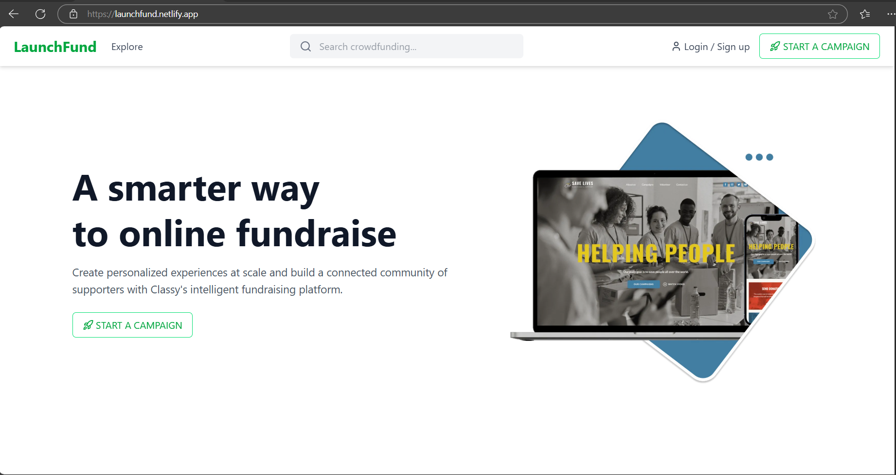

# LaunchFund

LaunchFund is a modern crowdfunding platform that enables users to create and manage campaigns, track donations in real-time, and engage with supporters through interactive features like live comments and updates.

## 🚀 Live Demo
[LaunchFund link ](https://launchfund.netlify.app/)


## 🛠️ Tech Stack
### Frontend:
- **React (Vite)** - Fast build tool for modern web apps.
- **Tailwind CSS** - Utility-first CSS framework for responsive UI.
- **JavaScript** - Main programming language for frontend logic.

### Backend:
- **Node.js & Express.js** - Backend framework for API creation.
- **MongoDB & Mongoose** - Database and ODM for storing campaign data.

## 📌 Features

### 1️⃣ Login & Sign-Up
- When a user first opens the webpage, the first option shown is **Login**.
- Click the **Create Account** button to register a new account.
- After creating an account, users must **log in** to access the main webpage.
- **Footer** includes web portal email, GitHub link, and more.

### 2️⃣ Home Section
- **Navbar contains:**
  - Search bar
  - Start Campaign
  - Explore
  - My Campaign
- Home page explains **what crowdfunding is** and its benefits.
- Users can view **ongoing campaigns** or create their own.
- **Footer** provides detailed information about the website.

### 3️⃣ Start a Campaign
Users can create their own crowdfunding campaigns by following these steps:
- Click the **Start Campaign** button on the navbar.
- Fill out the campaign form with the following fields:
  - **Campaign Title** - Enter the name of your campaign.
  - **Campaign Tagline** - Provide a short description.
  - **Campaign Card Image** - Upload an image using drag & drop.
  - **Location** - Enter the campaign's location.
  - **Category** - Choose from Health, Technology, Education, etc.
  - **Tags** - Enter up to 5 related tags.
  - **Goal Amount** - Set your fundraising goal.
- Click **Save & Continue** to create the campaign.


### 4️⃣ My Campaigns Section
- View all your created campaigns in **My Campaigns**.
- Options:
  - **View Details** - See detailed campaign progress.
  - **Delete Campaign** - Remove your campaign if needed.

🔎 **View Section Includes:**
- Campaign details (Location, Category, etc.)
- Total amount raised through crowdfunding.
- **Donation Breakdown** - Graphical representation of donations.
- List of donors and amounts contributed.
- Comments section where donors can leave messages.


### 5️⃣ Explore Section
- Browse all active campaigns from different categories.
- View other people's campaigns and contribute by donating money.
- When viewing another person’s campaign, users can:
  - **Donate** to the campaign.
  - **Comment** and engage with the campaign creator.

## 🏗️ Installation & Setup
Follow these steps to set up LaunchFund locally.

### 📌 Prerequisites
Ensure you have the following installed:
- **Node.js** (v14+)
- **MongoDB**

### 📥 Clone the Repository
```sh
git clone https://github.com/nileshyadav6702/launchfund.git
cd launchfund
```

### 🚀 Frontend Setup
```sh
cd frontend
npm install
npm run dev
```

### ⚙️ Backend Setup
```sh
cd backend
npm install
npm start
```

### 🎯 Environment Variables
Create a `.env` file in the **backend** directory with the following:
```env
MONGO_URI=your_mongodb_connection_string
PORT=5000
```

## 👥 Contributors
- **Your Name** - [GitHub](https://github.com/nileshyadav6702/launchfund)

## 📜 License
This project is open-source under the MIT License.

